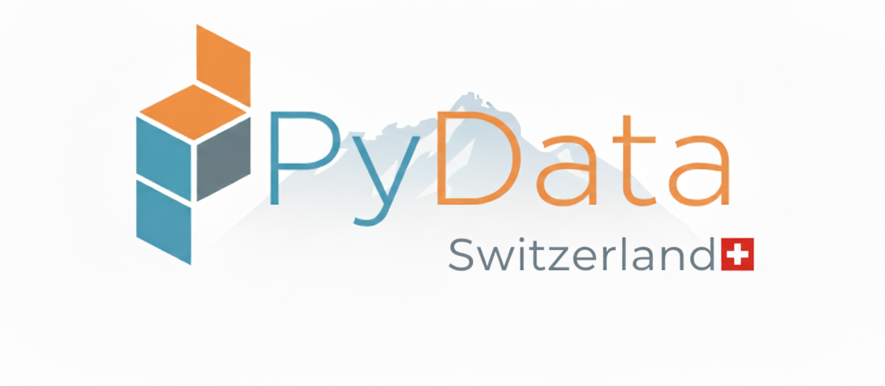
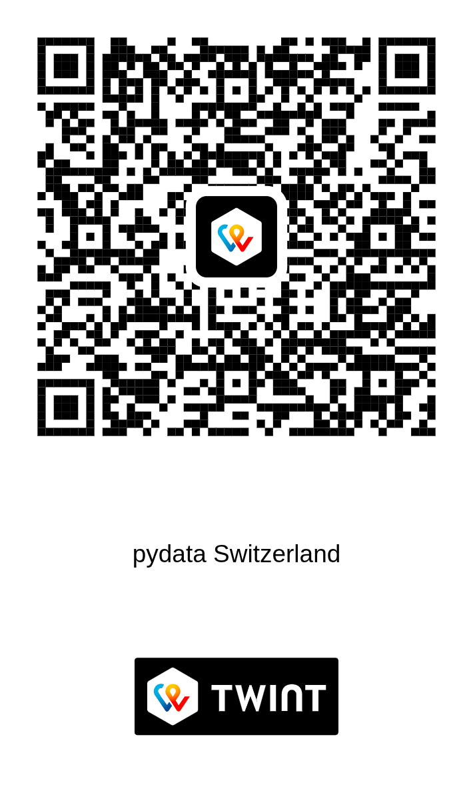

# PyData Switzerland [{:style="width:24px;height:24px;vertical-align:middle;"}](https://www.linkedin.com/company/pydata-switzerland/) [{:style="width:24px;height:24px;vertical-align:middle;"}](https://github.com/pydata-switzerland)

Welcome to the official website of **PyData Switzerland**!

We are a community of data enthusiasts, professionals, and researchers passionate about data science, machine learning, and open source in Switzerland.

## Association

We are an official association, under Swiss law, with official address at:

```
PyData Switzerland
Rue du Valentin 12,
1004 Lausanne
```

**2025 Founding Committee:**

- **President:** [Gianrocco Lazzari](https://www.linkedin.com/in/gianroccolazzari/)
- **Vice-President:** [Raphael Luthi](https://www.linkedin.com/in/raphaelluthi/)
- **Secretary:** [Marco Calizzi](https://www.linkedin.com/in/marco-calizzi/)
- **Valais-representant:** [Gary Folli](https://www.linkedin.com/in/gary-folli/)

## Tax-free Donations

IBAN: **CH91 0900 0000 1675 4573 5**

or, if you have Twint, click the button 👇

<div id="rnw-paylink-button-wcbhq"></div>
<script type="module">
  import {TwintButton} from "https://unpkg.com/@raisenow/paylink-button@2/dist/TwintButton.js"
  TwintButton.render("#rnw-paylink-button-wcbhq", {
    "solution-id": "wcbhq",
    "solution-type": "pay",
    "language": "en",
    "size": "medium",
    "width": "fixed",
    "color-scheme": "dark",
  })
</script>

or scan this QR code 👇



## Join our Whatsapp community {:style="width:24px;height:24px;vertical-align:middle;"} !

[Pydata Whatsapp community](https://chat.whatsapp.com/DaFqGL3IhMLKv3I5sKdO8U) 👈 inside you can find the chapter-related groups

## Get Involved

Attend or help us to organize our meetups in [Lausanne](https://www.meetup.com/pydata-lausanne/), [Valais](https://www.meetup.com/pydata-valais/), Geneva, [Basel](https://www.meetup.com/pydata-basel/), [Zurich](https://www.meetup.com/pydata-zurich/) -- we are always looking for 3S :) -- space, speakers and sponsors 

## Contact

For questions or collaboration, email us at [info@pydata.ch](mailto:info@pydata.ch) (but it will be faster on whatsapp :)

